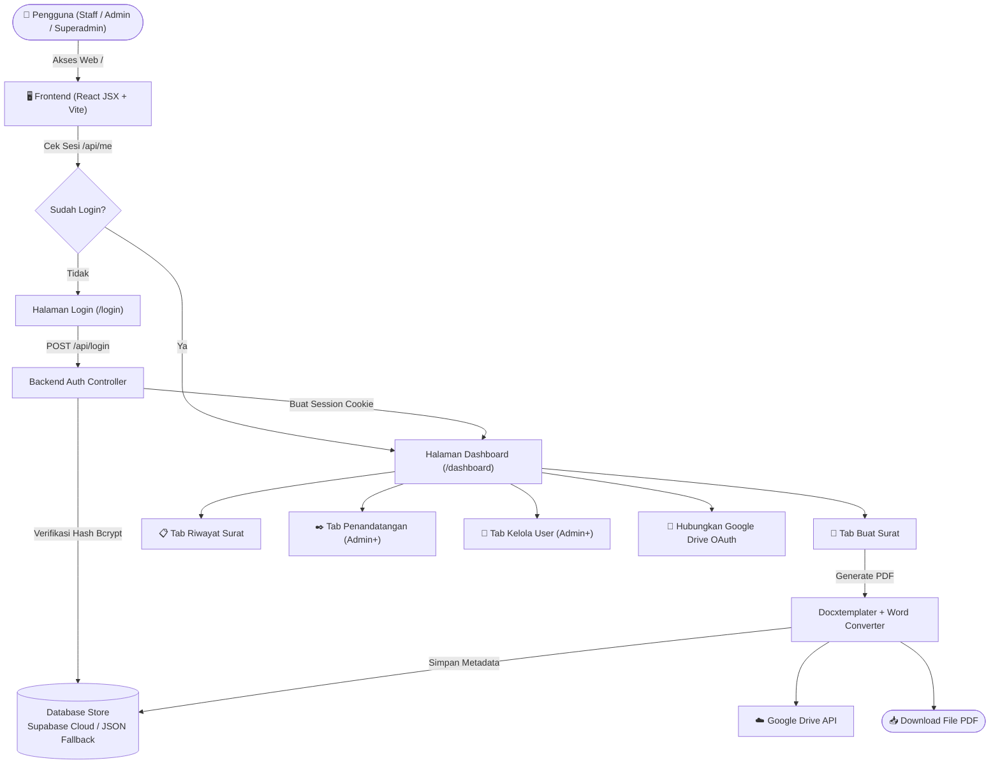
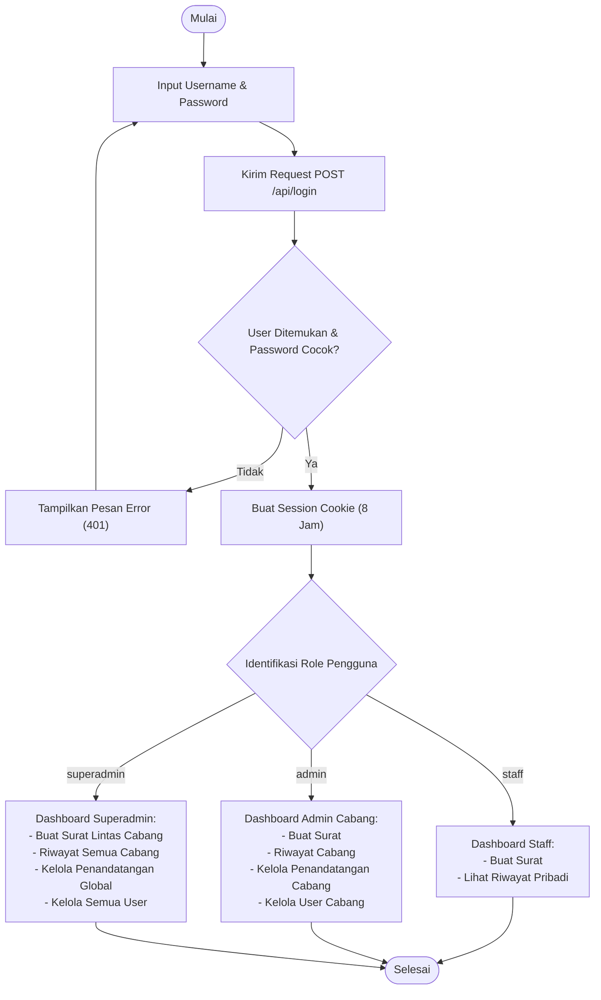
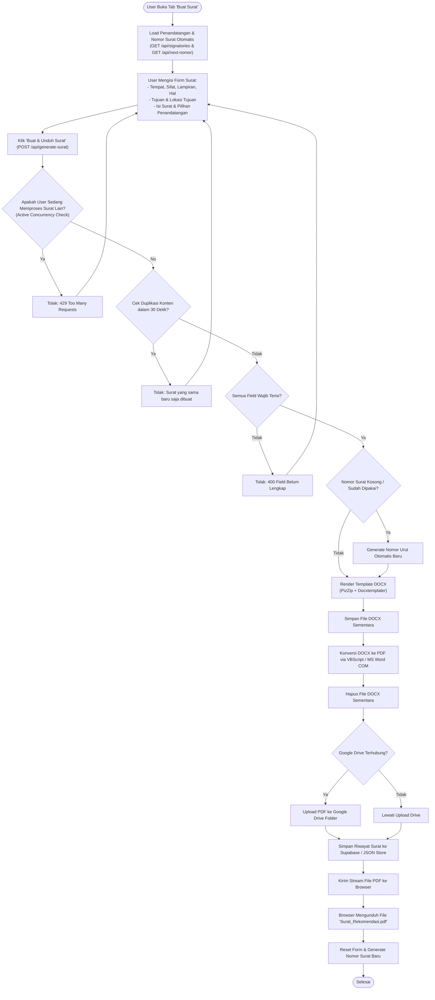
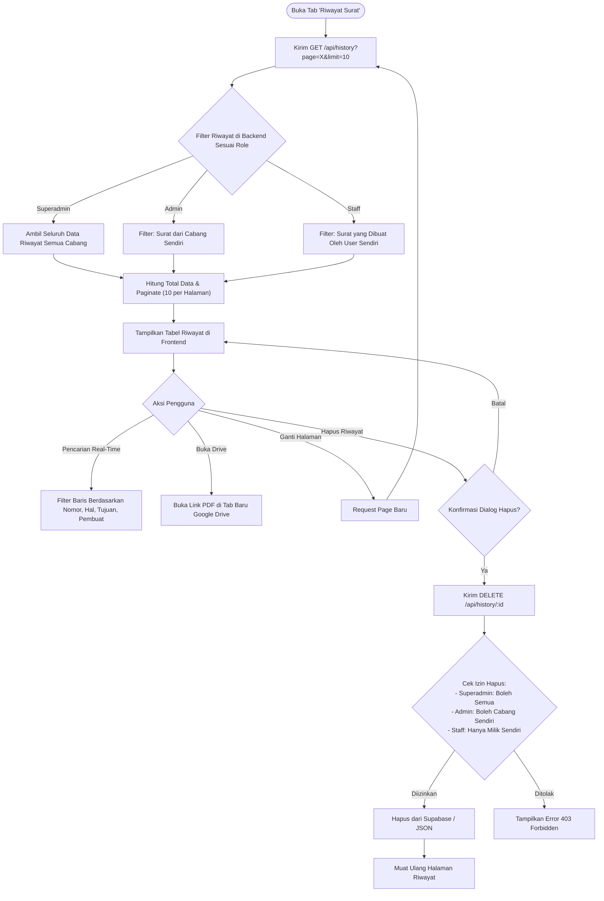
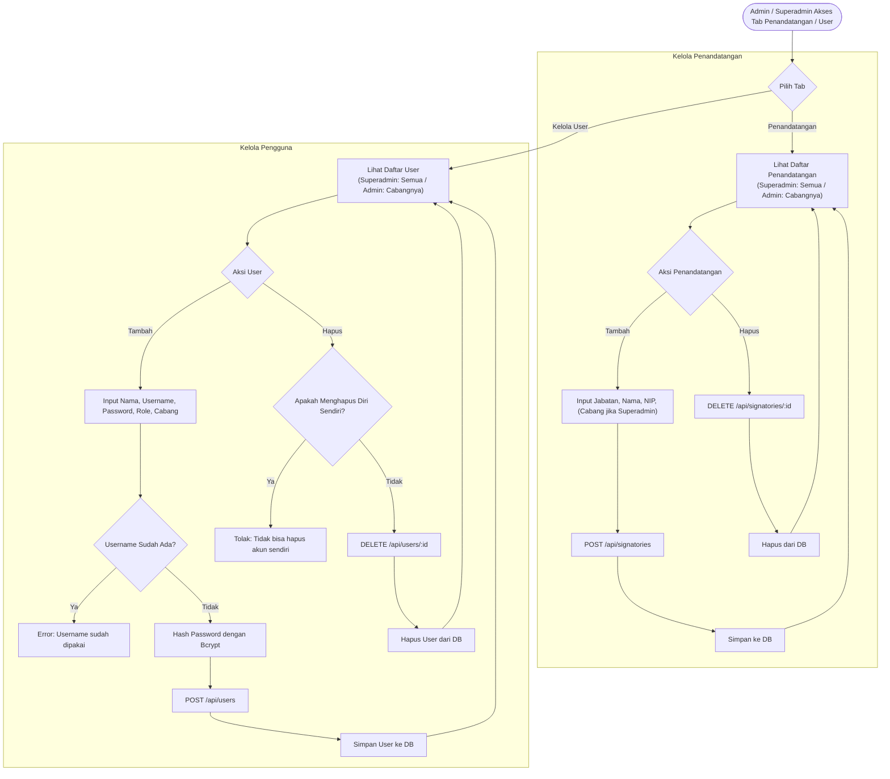
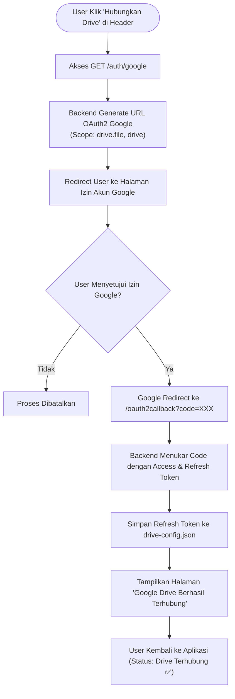

# Dokumentasi Flowchart & Alur Kerja Sistem Surat Rekomendasi

Dokumen ini berisi dokumentasi lengkap arsitektur sistem, alur proses bisnis, autentikasi pengguna, pembuatan surat otomatis, manajemen data, dan integrasi Google Drive pada aplikasi **Sistem Surat Rekomendasi**.

---

## Daftar Isi
1. [Arsitektur Sistem Keseluruhan](#1-arsitektur-sistem-keseluruhan)
2. [Autentikasi & Role-Based Access Control (RBAC)](#2-autentikasi--role-based-access-control-rbac)
3. [Alur Pembuatan Surat Rekomendasi (Core Process)](#3-alur-pembuatan-surat-rekomendasi-core-process)
4. [Alur Riwayat Surat & Pagination](#4-alur-riwayat-surat--pagination)
5. [Manajemen Pengguna & Penandatangan](#5-manajemen-pengguna--penandatangan)
6. [Integrasi Google Drive OAuth 2.0](#6-integrasi-google-drive-oauth-20)
7. [Spesifikasi API Endpoint & Hak Akses](#7-spesifikasi-api-endpoint--hak-akses)

---

## 1. Arsitektur Sistem Keseluruhan

Diagram ini menggambarkan interaksi antara pengguna, antarmuka Frontend React, Backend API Express.js, sistem pembuatan dokumen (Docxtemplater & VBScript Word Converter), Database Store (Supabase Cloud / JSON Fallback), dan Google Drive API.

### Penjelasan Komponen:
- **Frontend (React JSX + Vite)**: Menyediakan antarmuka bertema Glassmorphism dengan multi-tab dinamis berdasarkan role user.
- **Backend (Express.js)**: Menyediakan RESTful API, validasi request, pengelolaan session cookie (8 jam), dan pembatasan konkurensi pembuatan surat.
- **Data Layer (Store)**: Menggunakan Supabase Cloud PostgreSQL sebagai basis data utama dengan fallback otomatis ke file lokal JSON (`data/*.json`).
- **Document Engine**: Memproses placeholder dokumen DOCX dengan `Docxtemplater` + `PizZip`, lalu mengonversinya menjadi PDF berpresisi tinggi via VBScript Microsoft Word Automation.
- **Google Drive Integration**: Mengunggah PDF hasil konversi ke folder Google Drive secara otomatis via OAuth 2.0.

---

## 2. Autentikasi & Role-Based Access Control (RBAC)

Diagram ini mengilustrasikan alur login pengguna, verifikasi password, dan penentuan menu serta hak akses berdasarkan role (`staff`, `admin`, `superadmin`).

### Matriks Hak Akses Role:
| Fitur / Modul | Staff | Admin Cabang | Superadmin |
| :--- | :---: | :---: | :---: |
| **Buat Surat Rekomendasi** | ✅ (Cabang Sendiri) | ✅ (Cabang Sendiri) | ✅ (Semua Cabang) |
| **Riwayat Surat** | ✅ (Hanya Surat Sendiri) | ✅ (Surat Satu Cabang) | ✅ (Semua Cabang) |
| **Hapus Riwayat** | ✅ (Hanya Surat Sendiri) | ✅ (Surat Satu Cabang) | ✅ (Semua Surat) |
| **Kelola Penandatangan** | ❌ | ✅ (Cabang Sendiri) | ✅ (Semua Cabang) |
| **Kelola Pengguna (User)** | ❌ | ✅ (Cabang Sendiri) | ✅ (Semua Cabang & Role) |
| **Koneksi Google Drive** | ✅ | ✅ | ✅ |

---

## 3. Alur Pembuatan Surat Rekomendasi (Core Process)

Diagram ini merinci alur pembuatan surat dari input form, pencegahan spam/duplikasi, penomoran surat otomatis, render DOCX, konversi PDF, upload cloud, hingga streaming file download ke browser.

### Logika Khusus Pembuatan Surat:
1. **Pencegahan Race Condition**: Menggunakan Set `activeGenerations` pada backend untuk mencegah klik ganda/request bersamaan dari user yang sama.
2. **Anti-Duplikasi (30 Detik Debounce)**: Backend membuat hash dari `userId + hal + tujuan + isi_surat` dan menolak pembuatan surat identik dalam rentang waktu 30 detik.
3. **Format Nomor Surat Otomatis**:
   `B-{NomorUrut}/Kw.08.3.5/PP.00.{KodeJenis}/{Bulan}/{Tahun}`
   Contoh: `B-001/Kw.08.3.5/PP.00.07/09/2026`

---

## 4. Alur Riwayat Surat & Pagination

Diagram ini menunjukkan bagaimana data riwayat difilter berdasarkan hak akses role, fitur pencarian di sisi client, pagination 10 data per halaman, dan verifikasi izin penghapusan.

---

## 5. Manajemen Pengguna & Penandatangan

Diagram ini menjelaskan alur CRUD untuk penandatangan surat dan pengguna (user) oleh Admin dan Superadmin.

---

## 6. Integrasi Google Drive OAuth 2.0

Diagram ini menjelaskan proses otorisasi Google OAuth 2.0 agar aplikasi dapat mengunggah file PDF yang dihasilkan secara otomatis ke Google Drive pengguna.

---

## 7. Spesifikasi API Endpoint & Hak Akses

| Endpoint | Method | Role Minimum | Deskripsi |
| :--- | :---: | :---: | :--- |
| `/api/login` | `POST` | Publik | Otentikasi username & password, mengembalikan info user dan membuat session |
| `/api/logout` | `POST` | Auth | Menghancurkan session user yang aktif |
| `/api/me` | `GET` | Auth | Mengecek status login dan data user saat ini |
| `/auth/google` | `GET` | Publik | Memulai alur otentikasi Google OAuth 2.0 |
| `/oauth2callback` | `GET` | Publik | Callback Google OAuth 2.0 untuk menukar token |
| `/api/drive-status` | `GET` | Auth | Memeriksa apakah integrasi Google Drive aktif |
| `/api/branches` | `GET` | Auth | Mendapatkan daftar seluruh cabang yang tersedia |
| `/api/signatories` | `GET` | Auth | Mengambil data pejabat penandatangan (terfilter per cabang/global) |
| `/api/signatories` | `POST` | Admin | Menambahkan data pejabat penandatangan baru |
| `/api/signatories/:id` | `DELETE` | Admin | Menghapus pejabat penandatangan |
| `/api/users` | `GET` | Admin | Mengambil daftar pengguna |
| `/api/users` | `POST` | Admin | Membuat akun pengguna baru |
| `/api/users/:id` | `DELETE` | Admin | Menghapus akun pengguna (selain akun sendiri) |
| `/api/next-nomor` | `GET` | Auth | Menghitung nomor urut surat resmi berikutnya |
| `/api/generate-surat` | `POST` | Auth | Memproses DOCX → PDF, upload Google Drive, simpan riwayat, kirim file PDF |
| `/api/history` | `GET` | Auth | Mengambil daftar riwayat surat dengan paginasi & filter hak akses |
| `/api/history/:id` | `DELETE` | Auth | Menghapus riwayat surat (tervalidasi hak cabang/kepemilikan) |

